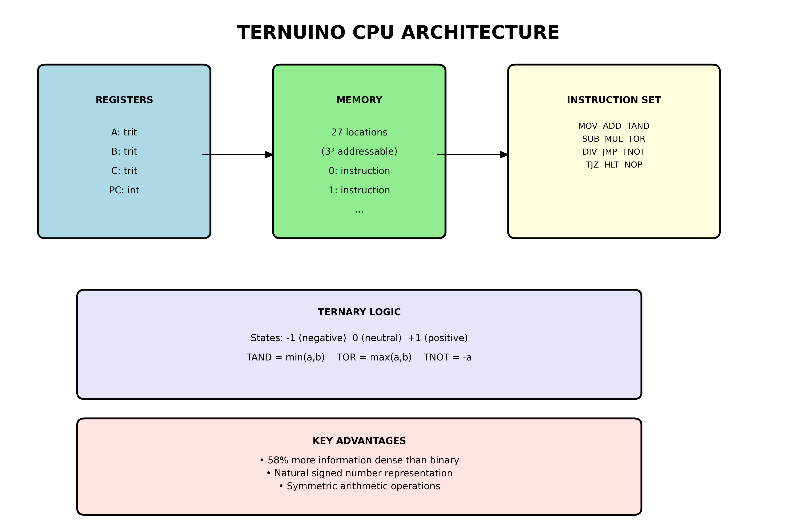

#  Ternuino CPU - Ternary Computer Simulator


A ternary (base-3) CPU simulator that demonstrates the advantages of three-state logic over traditional binary systems.
The Ternuino CPU uses trits (ternary digits) with values of -1, 0, and +1 instead of binary bits (0, 1).
This program was written by Swen "El Dockerr" Kalski (me) and is in active development. This Repository also contains a beginner friendly introduction of ternary computing what is part of my bachelor thesis in mathematics. 

A friendly, beginner‑oriented guide lives in [`docs/book/`](docs/book/README.md).


```
┌─────────────────────────────────────────────────────────────┐
│                    TERNUINO CPU ARCHITECTURE                │
├─────────────────────────────────────────────────────────────┤
│  REGISTERS           MEMORY              INSTRUCTION SET    │
│  ┌─────────┐        ┌──────────┐        ┌────────────────────────────┐│
│  │ A: trit │        │ 0: instr │        │ MOV  TAND   TSIGN  TSHL3   ││
│  │ B: trit │        │ 1: instr │        │ ADD  TOR    TABS   TSHR3   ││
│  │ C: trit │        │ 2: instr │        │ SUB  TNOT   TCMPR          ││
│  │         │        │    ...   │        │ MUL  JMP    TJN    TJP     ││
│  │ PC: int │        │26: instr │        │ DIV  TJZ    HLT    NOP     ││
│  └─────────┘        └──────────┘        └────────────────────────────┘│
│                                         └──────────────┘    │
│  TERNARY VALUES:  -1 (negative)  0 (neutral)  +1 (positive) │
└─────────────────────────────────────────────────────────────┘
```



## What is Ternary Computing?

Ternary computing uses three states instead of two:
- **-1** (negative/false)
- **0** (neutral/unknown)  
- **+1** (positive/true)

This provides a more natural representation for many logical operations and mathematical concepts.

## The Ternuino Book (Docs)
Ternary operations are the subject of my bachelor's thesis in mathematics. Ever since I heard about the Russian Setun computer a few years ago, this topic has been on my mind, and I am fascinated by the fact that we limit ourselves so much by only working with binary computers. That is why I have spun off parts of my bachelor thesis and would like to convince and inspire other makers and interested parties about this technology.


A friendly, beginner‑oriented guide lives in `docs/book/`.

- Start at `docs/book/README.md`
- Chapters cover ternary numbers, logic, TritWord, CPU architecture, assembly, examples, the visualizer, and an FAQ.

## Key Advantages of Ternary Over Binary Systems

### 1. **Information Density**
- **Ternary**: Each trit can represent 3 states, giving log₂(3) ≈ 1.585 bits of information per trit
- **Binary**: Each bit represents only 2 states (1 bit of information)
- **Result**: Ternary is ~58% more information-dense than binary

### 2. **Natural Representation of Signed Numbers**
```
Ternary: -1, 0, +1 (directly represents negative, zero, positive)
Binary:  Requires sign bit + magnitude or two's complement encoding
```

### 3. **Simpler Logic Operations**
The ternary logic operations are more intuitive:
- **TAND (Ternary AND)**: `min(a, b)` - Takes the minimum value
- **TOR (Ternary OR)**: `max(a, b)` - Takes the maximum value  
- **TNOT (Ternary NOT)**: `-a` - Simple negation

### 4. **Balanced Representation**
- Ternary naturally handles positive and negative values symmetrically
- No need for special encoding schemes like two's complement
- Zero has a natural, unique representation

### 5. **More Efficient for Multi-Valued Logic**
- Many real-world problems have three natural states (yes/no/maybe, true/false/unknown)
- Fuzzy logic and probabilistic reasoning map better to ternary
- Database NULL values have a natural representation

### 6. **Computational Efficiency**
- Fewer digits needed to represent the same range of numbers
- Example: Numbers 0-8 in different bases:
  ```
  Decimal: 0, 1, 2, 3, 4, 5, 6, 7, 8
  Binary:  000, 001, 010, 011, 100, 101, 110, 111, 1000 (up to 4 bits)
  Ternary: 00, 0+, +-, +0, ++, +-, +0, ++, +00 (up to 3 trits)
  ```

### Visual Comparison: Binary vs Ternary Logic


```
BINARY SYSTEM               │  TERNARY SYSTEM
                            │
States: 0, 1                │  States: -1, 0, +1
                            │
Truth Table (AND):          │  Truth Table (TAND):
0 AND 0 = 0                 │  -1 TAND -1 = -1
0 AND 1 = 0                 │  -1 TAND  0 = -1
1 AND 0 = 0                 │  -1 TAND +1 = -1
1 AND 1 = 1                 │   0 TAND  0 =  0
                            │   0 TAND +1 =  0
Encoding signed numbers:    │  +1 TAND +1 = +1
Requires 2's complement     │
or sign bit                 │  Natural signed representation:
                            │  No special encoding needed!
```

## Architecture Overview

### Registers
- **A, B, C**: General-purpose registers (each holds a single trit value)
- **PC**: Program Counter
- **Memory**: 27 memory locations (3³ addressable space)

### Instruction Set

| Instruction | Description | Example |
|-------------|-------------|---------|
| `NOP` | No operation | `("NOP",)` |
| `MOV reg, val` | Move value/register to register | `("MOV", "A", 1)` |
| `ADD reg1, reg2` | Add reg2 to reg1 | `("ADD", "A", "B")` |
| `SUB reg1, reg2` | Subtract reg2 from reg1 | `("SUB", "A", "B")` |
| `MUL reg1, reg2` | Multiply reg1 by reg2 | `("MUL", "A", "B")` |
| `DIV reg1, reg2` | Divide reg1 by reg2 (trunc. to 0) | `("DIV", "A", "B")` |
| `JMP addr` | Jump to address | `("JMP", 5)` |
| `TJZ reg, addr` | Jump if reg == 0 | `("TJZ", "A", 10)` |
| `TJN reg, addr` | Jump if reg < 0 | `("TJN", "A", 7)` |
| `TJP reg, addr` | Jump if reg > 0 | `("TJP", "A", 12)` |
| `TAND reg1, reg2` | Ternary AND (min) | `("TAND", "A", "B")` |
| `TOR reg1, reg2` | Ternary OR (max) | `("TOR", "A", "B")` |
| `TNOT reg` | Ternary NOT (negate) | `("TNOT", "A")` |
| `TSIGN reg` | reg := sign(reg) ∈ {-1,0,+1} | `("TSIGN", "A")` |
| `TABS reg` | reg := abs(reg) | `("TABS", "B")` |
| `TSHL3 reg` | reg := reg * 3 | `("TSHL3", "A")` |
| `TSHR3 reg` | reg := trunc(reg / 3) | `("TSHR3", "A")` |
| `TCMPR reg1, reg2` | reg1 := sign(reg1 - reg2) | `("TCMPR", "A", "B")` |
| `HLT` | Halt execution | `("HLT",)` |

### Ternary Logic Truth Tables

**TAND (min operation)**:
```
  a  |  b  | TAND
 -1  | -1  |  -1
 -1  |  0  |  -1
 -1  | +1  |  -1
  0  | -1  |  -1
  0  |  0  |   0
  0  | +1  |   0
 +1  | -1  |  -1
 +1  |  0  |   0
 +1  | +1  |  +1
```

**TOR (max operation)**:
```
  a  |  b  | TOR
 -1  | -1  |  -1
 -1  |  0  |   0
 -1  | +1  |  +1
  0  | -1  |   0
  0  |  0  |   0
  0  | +1  |  +1
 +1  | -1  |  +1
 +1  |  0  |  +1
 +1  | +1  |  +1
```

### Ternary Arithmetic Operations

The ternary system provides natural and symmetric arithmetic operations:

**Addition/Subtraction**: Works naturally with positive and negative values
```
Ternary addition examples:
 1 + (-1) =  0  (positive + negative = neutral)
-1 + (-1) = -2  (fully symmetric)
 1 +   1  =  2  
```

**Multiplication**: Simple and intuitive
```
Ternary multiplication table:
-1 × -1 =  1  (negative × negative = positive)
-1 ×  0 =  0  (anything × zero = zero)
-1 ×  1 = -1  (negative × positive = negative)
 0 × any =  0
 1 ×  1 =  1
```

**Division**: Handles sign naturally, with safe division by zero
- Division by zero returns 0 (could be configured to halt or set error flag)
- Natural handling of negative results
- Truncation towards zero for fractional results

## File Structure

```
ternuino-cpu/
├── docs/               # Documentation and diagrams
│   ├── ternuino-architecture.png  # CPU architecture diagram
│   ├── binary-vs-ternary.png      # Comparison chart
│   └── *.svg                      # Vector versions of diagrams
├── library/
│   ├── ternuino.py     # Main CPU simulator
│   ├── tritlogic.py    # Ternary logic operations
│   ├── tritword.py     # Multi-trit word handling
│   └── assembler.py    # Assembly language parser
├── programs/           # Assembly language programs
│   ├── logic_demo.asm      # Basic ternary logic demo
│   ├── arithmetic_demo.asm # Arithmetic operations demo
│   ├── loop_demo.asm       # Loop and jump demo
│   └── fibonacci_demo.asm  # Fibonacci-like sequence
├── interpreter.py      # Main program runner with assembly support
├── arithmetic_test.py  # Arithmetic operations test suite
├── generate_diagrams.py # Script to create documentation images
├── README.md          # This file
└── ASSEMBLY.md        # Assembly language reference
```

## Usage Example

```python
from library.ternuino import Ternuino

# Example program: demonstrate ternary logic and arithmetic
program = [
    ("MOV", "A", 1),      # A = +1 (positive)
    ("MOV", "B", -1),     # B = -1 (negative)
    ("TAND", "A", "B"),   # A = min(+1, -1) = -1
    ("TNOT", "A"),        # A = -(-1) = +1
    ("SUB", "A", "B"),    # A = +1 - (-1) = +2
    ("DIV", "A", "B"),    # A = +2 / (-1) = -2
    ("HLT",)              # Stop execution
]

cpu = Ternuino()
cpu.load_program(program)
cpu.run()
print(cpu.registers)  # Output: {'A': -2, 'B': -1, 'C': 0}
```

### Arithmetic Operations Example

```python
# Demonstrate ternary arithmetic advantages
program_arithmetic = [
    ("MOV", "A", 1),      # A = +1
    ("MOV", "B", -1),     # B = -1
    ("MOV", "C", 0),      # C = 0
    ("ADD", "A", "B"),    # A = 1 + (-1) = 0 (perfectly balanced)
    ("MUL", "B", "B"),    # B = (-1) * (-1) = 1 (negative squared = positive)
    ("SUB", "C", "A"),    # C = 0 - 0 = 0 (neutral operations)
    ("HLT",)
]
```

## Running the Simulator

### Interactive Mode
```bash
python interpreter.py
```
This will show a menu of available assembly programs to choose from.

### Run Specific Program
```bash
python interpreter.py programs/logic_demo.asm
```

### Available Example Programs
- `logic_demo.asm` - Basic ternary logic operations
- `arithmetic_demo.asm` - Arithmetic operations (ADD, SUB, MUL, DIV)
- `loop_demo.asm` - Loops and jumps with labels
- `fibonacci_demo.asm` - Fibonacci-like sequence calculation
- `ternary_sign_and_branch.asm` - Three-way compare and branching using TSIGN/TCMPR/TJN/TJP
- `ternary_shift_scale.asm` - Base-3 scaling with TSHL3/TSHR3 plus TABS/TSIGN
- `three_way_select_demo.asm` - 3-way decision using sign and ternary branches

### Testing Arithmetic Operations

```bash
python arithmetic_test.py
```

This will run comprehensive tests of the new arithmetic operations (SUB, MUL, DIV) and demonstrate the advantages of ternary arithmetic.

### Hardware Visualizer (GUI)

An interactive Tkinter GUI to visualize registers, memory, PC, and ternary logic:

```bash
python visualizer.py
```

Features:
- Load existing programs from the `programs/` folder
- Step through instructions or run continuously with adjustable speed
- Watch registers and memory update live
- Explore ternary logic (TAND, TOR, TNOT) and a conceptual ternary "transistor" indicator

### Regenerating Documentation Images

```bash
python generate_diagrams.py
```

This will regenerate the architecture diagrams and comparison charts (requires matplotlib).


## Assembly Language

The Ternuino now supports a simple assembly language! Write your programs in `.asm` files and place them in the `programs/` directory. 

### Example Assembly Program
```assembly
# Simple ternary logic demonstration
MOV A, 1        # A = +1 (positive)
MOV B, -1       # B = -1 (negative)
TAND A, B       # A = min(+1, -1) = -1
TNOT A          # A = -(-1) = +1
HLT             # Stop execution
```

See `ASSEMBLY.md` for complete language reference and examples.

## Practical Applications

1. **Database Systems**: Natural representation of NULL values
2. **Fuzzy Logic**: Three-state logic for uncertain reasoning
3. **Signal Processing**: Representation of positive, negative, and zero signals
4. **Control Systems**: On/Off/Standby states
5. **Machine Learning**: Ternary neural networks for efficient computation

## Historical Context

Ternary computers were actually built and used:
- **Setun** (1958): Soviet ternary computer, proved ternary systems are practical
- **Setun 70** (1970s): Improved version with better performance
- Modern research continues into ternary computing for quantum systems and neural networks

## Future Enhancements

- [ ] Memory management instructions
- [x] Arithmetic operations (SUB, MUL, DIV)
- [ ] I/O operations
- [ ] Interrupt handling
- [x] Assembler for human-readable assembly language
- [ ] Debugger with step-by-step execution
- [ ] Performance comparison tools vs. binary systems
- [ ] Implementation of a simple logic on hardware

## References

- "The Art of Computer Programming" - Knuth, D.E. - discusses ternary number systems
- "Ternary Logic and Circuits" - John Gregg
